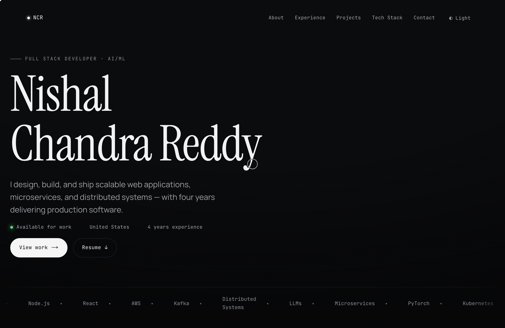
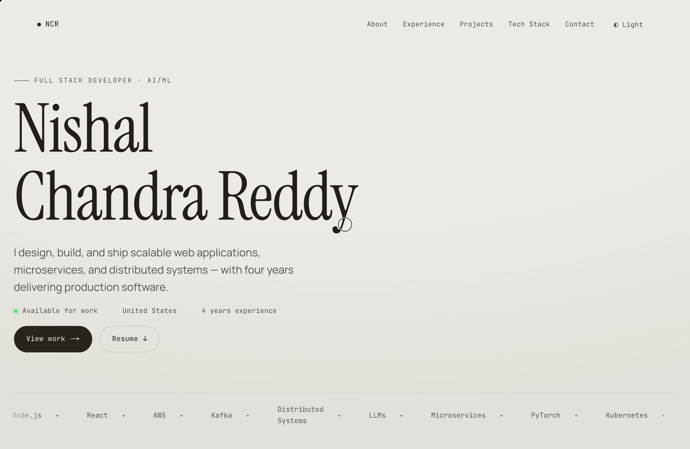

# Nishal Chandra Reddy — Portfolio

A fast, accessible, single-page developer portfolio built as a statically
exported Next.js site. Dark/light theming, editorial typography, and motion that
respects `prefers-reduced-motion` — all shipped as plain HTML/CSS/JS.

[](https://github.com/nishalcr/nishalcr.github.io/actions/workflows/ci.yml)
[](./LICENSE)
[](https://nextjs.org)
[](https://www.typescriptlang.org)

**Live:** https://nishalcr.is-a.dev



<details>
<summary>Light theme</summary>



</details>

## Highlights

- **Static export** (`output: "export"`) — deployable free to any static host; no server.
- **Self-hosted fonts** via `next/font` — no render-blocking requests, no layout shift.
- **Accessible** — skip-link, visible focus rings, 44px targets, full `prefers-reduced-motion` support, WCAG-AA contrast.
- **SEO** — metadata, Open Graph + Twitter cards, JSON-LD `Person`, generated `sitemap.xml` / `robots.txt`, build-time OG image.
- **One-file content model** — all copy lives in [`lib/data.ts`](./lib/data.ts); a `**bold**` mini-syntax renders safely (no `dangerouslySetInnerHTML`).
- **Themed** — dark/light with a no-flash inline script and `useSyncExternalStore` (no hydration mismatch).

## Tech stack

| Area      | Choice                                                  |
| --------- | ------------------------------------------------------- |
| Framework | Next.js 16 (App Router, static export)                  |
| Language  | TypeScript (strict)                                     |
| UI        | React 19, hand-authored CSS design system (OKLCH)       |
| Fonts     | `next/font` — Instrument Serif, Manrope, JetBrains Mono |
| Tests     | Vitest + Testing Library (unit), Playwright (e2e)       |
| Quality   | ESLint (flat config) + Prettier                         |
| CI/CD     | GitHub Actions → GitHub Pages                           |

## Project structure

```
app/            App Router: layout, page, metadata, sitemap/robots, OG image
components/     UI sections + client interaction hooks (nav, reveal, cursor, theme)
lib/data.ts     Single source of truth for all site content
lib/site.ts     Canonical site URL (SEO)
lib/richtext.tsx  Safe **bold** → <b> renderer
tests/          Vitest unit tests
e2e/            Playwright smoke tests
```

## Local development

```bash
nvm use          # Node 20 (see .nvmrc)
npm ci
npm run dev      # http://localhost:3000
```

### Scripts

| Script                            | What it does                               |
| --------------------------------- | ------------------------------------------ |
| `npm run dev`                     | Start the dev server                       |
| `npm run build`                   | Production build → static export in `out/` |
| `npm run typecheck`               | `tsc --noEmit`                             |
| `npm run lint`                    | ESLint                                     |
| `npm run format` / `format:check` | Prettier write / check                     |
| `npm test`                        | Vitest unit tests                          |
| `npm run test:e2e`                | Playwright smoke tests (build first)       |

A `husky` pre-commit hook runs `lint-staged` so staged files are auto-linted and
formatted. CI runs typecheck, lint, format check, build, unit and e2e tests on
every PR.

## Editing content

All site content is in **[`lib/data.ts`](./lib/data.ts)** — edit the strings; wrap
a phrase in `**double asterisks**` for bold. To swap the résumé, overwrite
**`public/resume.pdf`**. See the header comment in `lib/data.ts`.

## Deployment

Free on GitHub Pages with an `is-a.dev` subdomain — see **[DEPLOY.md](./DEPLOY.md)**.

## License

[MIT](./LICENSE) © Nishal Chandra Reddy
